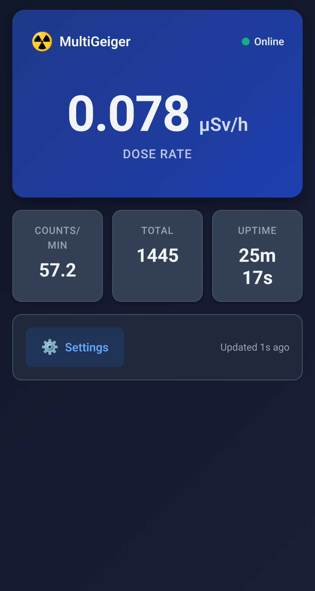
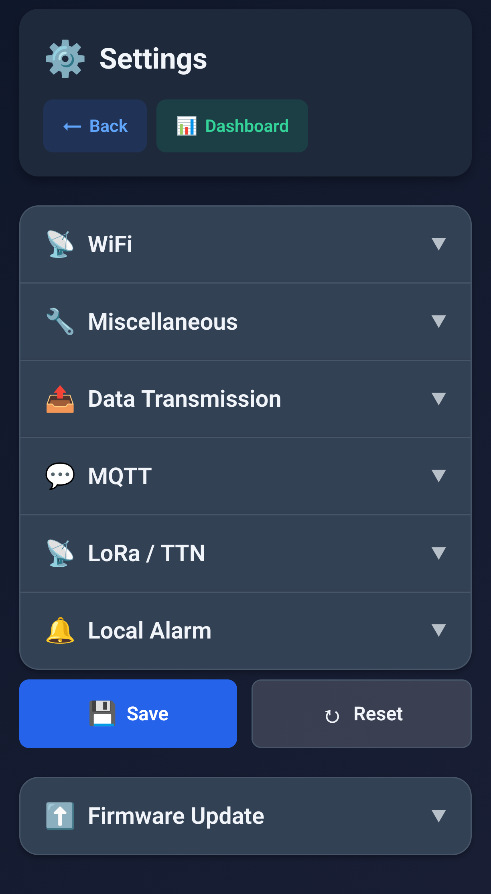
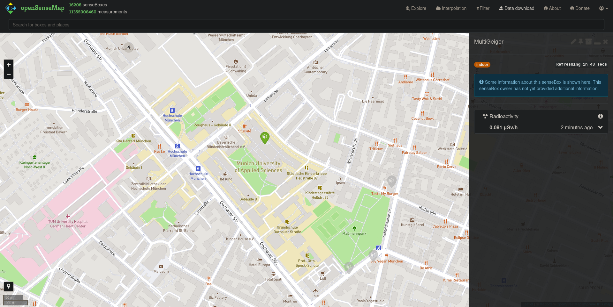
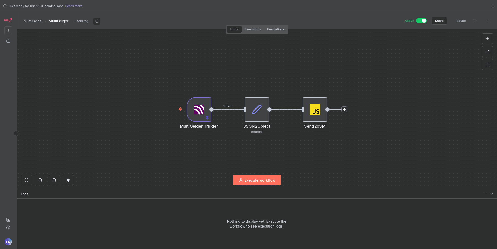

# MultiGeiger 🛰️

[](https://github.com/Ecocurious2/MultiGeiger/actions/workflows/build.yml)
[](https://multigeiger.readthedocs.org/)

The MultiGeiger is an **ESP32-based radioactivity measurement device** designed for citizen science projects. It features a modern web interface, multiple connectivity options (WiFi, LoRa, BLE), and environmental sensors for comprehensive environmental monitoring.

## ✨ Key Features

- 📊 **Radiation Measurement** - Accurate detection using Geiger-Müller tubes with real-time CPM/CPS display
- 🌐 **Modern Web Interface** - Responsive dashboard with live updates and easy configuration
- 📡 **Multiple Connectivity** - WiFi, LoRaWAN/TTN, BLE, MQTT with TLS support
- 🌡️ **Environmental Sensors** - Optional temperature, humidity, and pressure monitoring (BME280/BME680)
- ☁️ **Cloud Integration** - Automatic upload to sensor.community, madavi.de, OpenSenseMap, and custom endpoints
- 🔋 **Low Power Design** - Optimized for battery operation with deep sleep support

## 🚀 Quick Start

**Default WiFi Credentials:**

- SSID: `MultiGeiger-XXXXXX` (last 6 digits of MAC address)
- Password: `ESP32Geiger`

**Steps:**

1. 🔌 Power on your MultiGeiger device
2. 📶 Connect to the WiFi access point
3. 🌐 Open http://192.168.4.1 in your browser
4. ⚙️ Configure your settings via the web interface

## 🖥️ Web Interface

The MultiGeiger features a **modern, mobile-optimized web interface** with a clean, responsive design:

| **Home Dashboard** | **Configuration Page** |
|:------------------:|:----------------------:|
|  |  |
| Real-time monitoring with:<br>• 📈 Live radiation levels (CPM, CPS, µSv/h)<br>• 🌡️ Environmental data<br>• 📊 Historical graphs<br>• 🔔 Status indicators | Easy setup with collapsible sections:<br>• 📶 WiFi configuration<br>• 📡 MQTT settings (with TLS)<br>• 🛰️ LoRaWAN/TTN credentials<br>• ☁️ Data platform integration |

**Access Points:**

- AP Mode: http://192.168.4.1/
- Network Mode: http://multigeiger.local/ (mDNS)
- Direct IP: http://\<device-ip\>/

## 📡 Connectivity Options

### WiFi 📶

Standard 802.11 b/g/n connectivity for:

- Web interface access
- MQTT data publishing
- HTTP uploads to sensor.community and madavi.de
- OTA firmware updates

### LoRaWAN 🛰️

Long-range connectivity via **The Things Network (TTN v3)**:

- **Activation Mode**: ABP (Activation By Personalization)
- **Frequency Plan**: EU868 (868.1 MHz)
- **Payload**: 10 bytes (radiation data) + 5 bytes (environmental data)
- **Compatibility**: Works with single-channel gateways (e.g., Dragino LG01-N)

> **Note:** MultiGeiger uses ABP instead of OTAA to ensure compatibility with single-channel LoRaWAN gateways which cannot reliably handle OTAA join procedures.

See [LoRa Setup Guide](docs/source/setup_lora.rst) for TTN configuration.

### MQTT 📨

Publish data to any MQTT broker (Mosquitto, HiveMQ, etc.):

- **Protocols**: MQTT 3.1.1, MQTT over TLS
- **Topics**: Configurable (default: `multigeiger/<chip-id>/data`)
- **Payload**: JSON format with all sensor readings
- **QoS**: Configurable (0, 1, or 2)

### Bluetooth Low Energy (BLE) 📲

Local data access for mobile apps and nearby devices.

## 🌐 Cloud Integration & Data Forwarding

The MultiGeiger can send data to various platforms. Beyond direct uploads, you can leverage **TTN's MQTT server** to forward data to additional services.

### TTN MQTT Server 🔄

**The Things Network provides an MQTT server** that pushes real-time uplink messages. You can use this to forward MultiGeiger data to other platforms like OpenSenseMap.

**Setup:**

1. 🔑 Create an API key in your TTN Application:
   - Go to **Applications** → Your Application → **API keys**
   - Click **+ Add API key**
   - Grant rights: `Read application traffic`
   - Copy the generated key

2. 📡 Connect to TTN MQTT broker:
   - **Host**: `<region>.cloud.thethings.network` (e.g., `eu1.cloud.thethings.network`)
   - **Port**: `8883` (TLS) or `1883` (plain)
   - **Username**: `<application-id>@ttn`
   - **Password**: `<api-key>`
   - **Topic**: `v3/<application-id>/devices/+/up`

3. 🔀 Forward data using Node-RED, n8n, or custom scripts

### OpenSenseMap Integration 🗺️

Forward TTN data to OpenSenseMap for public visualization:



**Step 1: Create OpenSenseMap Sensor**

1. Register at https://opensensemap.org/
2. Create a new senseBox (manual configuration)
3. Add a sensor for radiation (phenomenon: "Ionizing Radiation", unit: "µSv/h")
4. Note your `senseBoxId` and `sensorId`

**Step 2: n8n Workflow for Data Forwarding**

Use n8n (or Node-RED) to subscribe to TTN MQTT and forward to OpenSenseMap:



**n8n Code Node Example:**

```javascript
const senseBoxId = '<your-sensebox-id>';  // Your Box-ID from OpenSenseMap
const sensorId = '<your-sensor-id>';      // Your Sensor-ID for radiation

// Extract decoded payload from TTN
const rawValue = $input.first().json.message.uplink_message.decoded_payload.uSvph;
const roundedValue = parseFloat(rawValue.toFixed(3));  // Round to 3 decimals

const data = { value: roundedValue };

// POST to OpenSenseMap ingress API
const response = await this.helpers.httpRequest({
  method: 'POST',
  url: `https://ingress.opensensemap.org/boxes/${senseBoxId}/${sensorId}`,
  headers: {
    'Content-Type': 'application/json'
  },
  body: data,
  options: {
    response: { fullResponse: true }
  }
});

return [{ json: {
  status: response.statusCode,
  data: data
}}];
```

**Workflow Overview:**

1. 📨 **MQTT Trigger Node**: Subscribe to TTN uplink topic
2. 🔧 **Code Node**: Extract and transform payload
3. 🌐 **HTTP Request**: POST to OpenSenseMap API

### Direct Uploads 📤

MultiGeiger can directly upload to:

- **sensor.community** (luftdaten.info): Particulate matter and radiation map
- **madavi.de**: Long-term data archival and visualization
- **Custom HTTP endpoints**: JSON POST with configurable headers

See [Deployment Guide](docs/source/deployment.rst) for configuration details.

## 🔧 Development & Building

### Requirements 📋

- **PlatformIO**: For ESP32 firmware compilation
- **Python 3.11+**: For build tools and documentation
- **uv**: Modern Python package manager (`pip install uv`)

### Makefile Commands 🛠️

The project uses a **Makefile** for common tasks:

**Build & Flash:**

```bash
make build          # Build web assets + compile firmware
make web            # Build web interface only (embed_web.py)
make flash          # Upload firmware to device
make monitor        # Open serial monitor (115200 baud)
make clean          # Clean build artifacts
```

**Development:**

```bash
make format         # Format code (clang-format, prettier)
make lint           # Run linters (cpplint, eslint)
make test           # Run unit tests
```

**Documentation:**

```bash
make docs           # Build Sphinx documentation
make docs-serve     # Serve docs locally (http://localhost:8000)
make docs-clean     # Clean documentation build
```

**Release:**

```bash
make release        # Build release firmware (optimized)
```

The Makefile automates:

- 🌐 **Web asset bundling**: Minifies HTML/CSS/JS and embeds them into firmware
- 📦 **Dependency management**: Installs PlatformIO libraries
- 🔨 **Multi-environment builds**: ESP32, ESP32-S2, ESP32-C3 variants
- 🚀 **CI/CD integration**: Same commands used in GitHub Actions

### Project Structure 📁

```
MultiGeiger/
├── src/                     # ESP32 firmware (C++)
│   ├── app/                 # Application logic
│   ├── comm/                # Communication modules
│   │   ├── wifi/            # WiFi, HTTP, mDNS
│   │   ├── lora/            # LoRaWAN (LMIC)
│   │   └── mqtt/            # MQTT client
│   ├── sensors/             # Geiger tube, BME280/680
│   └── main.cpp             # Entry point
├── web/                     # Web interface
│   ├── index.html           # Dashboard
│   ├── config.html          # Configuration page
│   ├── config.js            # Config logic
│   └── styles.css           # Responsive styles
├── docs/                    # Sphinx documentation
│   ├── source/              # reStructuredText files
│   ├── images/              # Screenshots
│   └── assembly/            # Assembly PDFs
├── tools/                   # Build & data tools
│   ├── embed_web.py         # Minify & embed web assets
│   ├── ttn_fetcher/         # TTN data downloader
│   │   ├── fetch_ttn_data.py    # CLI tool
│   │   ├── ttn_daemon.py        # Background daemon
│   │   └── README.md        # TTN fetcher docs
│   └── mqtt_logger/         # MQTT to SQLite logger
├── .github/                 # CI/CD workflows
│   └── workflows/
│       └── build.yml        # Automated builds
├── platformio.ini           # PlatformIO configuration
├── Makefile                 # Build automation
└── README.md                # This file
```

## 📊 Data Tools

### TTN Data Fetcher 📡

Download and archive LoRaWAN uplink data from TTN Storage Integration API:

```bash
cd tools/ttn_fetcher

# Install dependencies
pip install -r requirements.txt

# Create config
cp ttn_config.example.json ttn_config.json
nano ttn_config.json  # Add your TTN API credentials

# Fetch data once
python3 fetch_ttn_data.py --config ttn_config.json

# Run as daemon (poll every 5 minutes)
python3 ttn_daemon.py --config ttn_config.json --interval 300
```

**Features:**

- 💾 SQLite database storage with automatic deduplication
- 📊 Parse decoded payloads (GM counts, CPM, CPS, tube info)
- 📤 Export to JSON or CSV
- 🔄 Daemon mode with systemd service support
- 🔍 Query historical data with SQL

See [tools/ttn_fetcher/README.md](tools/ttn_fetcher/README.md) for full documentation.

### MQTT Logger 📝

Log MQTT data to SQLite database:

```bash
cd tools/mqtt_logger
cp .env.example .env
nano .env  # Configure MQTT broker
uv sync
uv run mqtt_logger.py
```

See [tools/mqtt_logger/README.md](tools/mqtt_logger/README.md) for details.

## 🛠️ Hardware

### Supported Boards 🎛️

- **Heltec WiFi Kit 32** (recommended)
- **Heltec Wireless Stick**
- **Generic ESP32** (with modifications)

### Required Components 🔩

- ☢️ **Geiger-Müller tube** (various types supported: SBM-20, SBM-19, SI-3BG, etc.)
- ⚡ **High voltage generator** (400-500V for GM tube)
- 🌡️ **Optional**: BME280/BME680 environmental sensor (I²C)
- 📡 **Optional**: LoRa module (SX1276/RFM95W for TTN)

See hardware documentation in [docs/hardware/](docs/hardware/) for schematics and PCB files.

### Assembly Guide 📖

Download the detailed assembly instructions (German):

- [Aufbauanleitung.pdf](docs/assembly/Aufbauanleitung.pdf)

## 📚 Documentation

### Online Documentation 🌐

**📖 https://multigeiger.readthedocs.org/**

Comprehensive documentation with:

- 🌍 **Multi-language support** (English + Deutsch) - use the language switcher in the lower right
- 📌 **Versioned docs** (latest, stable, specific releases)
- 🔍 **Full-text search**
- 📱 **Mobile-optimized**

### Key Pages 📄

- [Setup Instructions](docs/source/setup.rst) - WiFi, MQTT, platform configuration
- [LoRa/TTN Setup](docs/source/setup_lora.rst) - ABP configuration for The Things Network
- [Deployment Guide](docs/source/deployment.rst) - Production setup and troubleshooting
- [FAQ](docs/source/faq.rst) - Common questions and solutions
- [Development Guide](docs/source/development.rst) - Contributing and development setup

### Build Locally 🏗️

```bash
make docs              # Build with Sphinx
make docs-serve        # Serve at http://localhost:8000
```

Generated docs: `docs/build/html/index.html`

## 🗺️ Community & Resources

- 🌍 **Live Radiation Map**: https://multigeiger.citysensor.de/ - Real-time data from deployed sensors
- 🏗️ **Ecocurious Project Page**: https://ecocurious.de/projekte/multigeiger-2/ (German)
- 🎥 **Video Tutorials**: https://play.wa.binary-kitchen.de/_/global/raw.githubusercontent.com/ecocurious2/rc3_2020/main/main.json (German)
- 💬 **Discussion & Support**: GitHub Issues and Discussions

## 🤝 Contributing

Contributions are welcome! 🎉

- 🐛 **Bug Reports**: Open an issue with reproduction steps
- ✨ **Feature Requests**: Describe your use case
- 🔧 **Pull Requests**: Fork, branch, test, and submit

**Quality Standards:**

- ✅ **Automated CI/CD**: GitHub Actions runs builds and tests on all PRs
- 📝 **Documentation**: Update docs for user-facing changes
- 🧪 **Testing**: Ensure existing functionality works

See [.github/README.md](.github/README.md) for CI/CD details.

## 📄 License

See [LICENSE](LICENSE) file for details.

## 👥 Authors & Credits

See [AUTHORS](AUTHORS) file for contributors.

---

*Made with ❤️ by the Ecocurious community for citizen science and environmental monitoring*

**Support the project:** ⭐ Star this repo | 🐛 Report bugs | 📖 Improve docs | 💡 Share ideas
